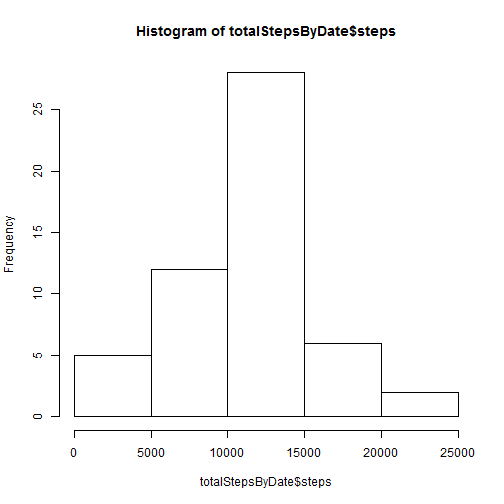

## Loading and preprocessing the data


```r
setwd('C:\\Data2\\Coursera\\ReproducibleResearch\\RepData_PeerAssessment1')
library(ggplot2)
library(knitr)

#read data using read.csv
if (sum(dir(path = ".") == "activity.csv") > 0) {
  data <- read.csv(".\\activity.csv",header=TRUE,sep=",")
}
```


## What is mean total number of steps taken per day?


```r
#sum steps by each date
totalStepsByDate <- aggregate(steps ~ date,data=cdata, FUN = sum)

#plot total steps by date
hist(totalStepsByDate$steps)
```

 
## What is the average daily activity pattern?


## Imputing missing values


## Are there differences in activity patterns between weekdays and weekends?
